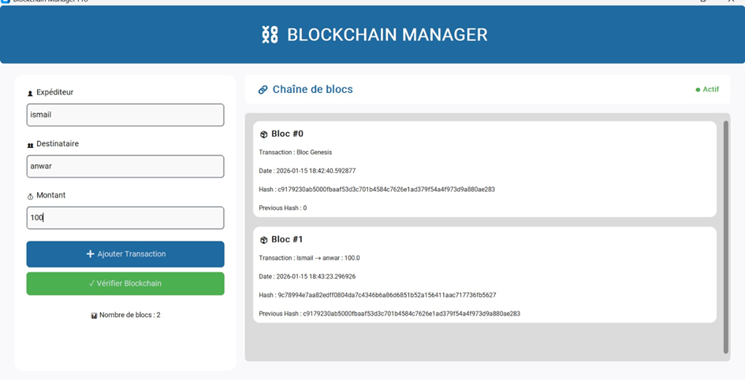
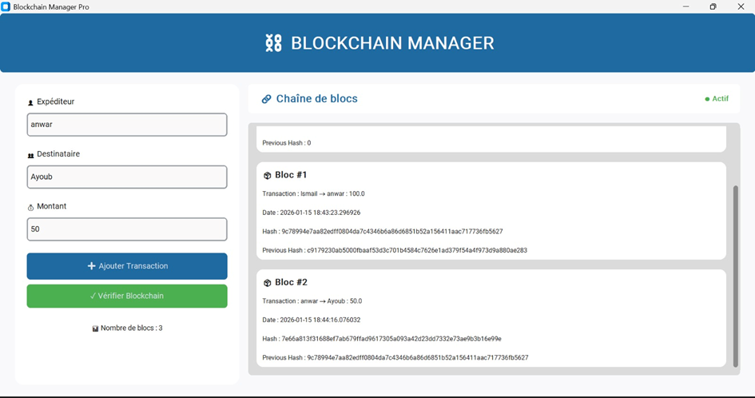
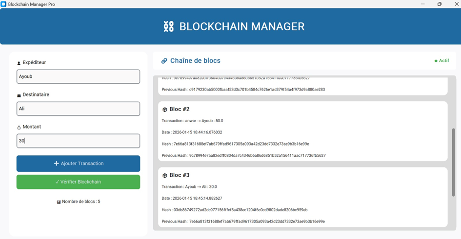
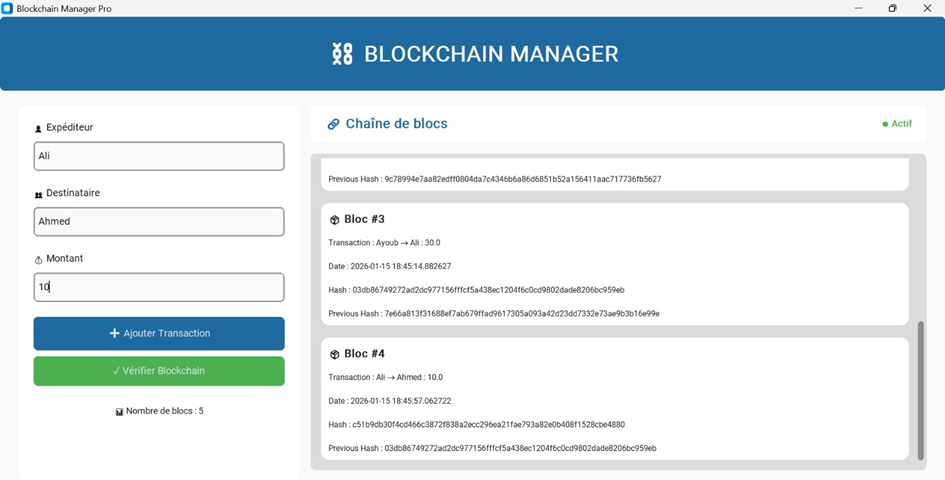

# 🔗 Blockchain Manager

## 📌 Description
**Blockchain Manager** est une application développée dans un cadre académique afin de simuler le fonctionnement d’une blockchain.  
Elle permet l’enregistrement de transactions entre utilisateurs sous forme de blocs liés cryptographiquement, garantissant l’intégrité et l’immuabilité des données.

---

## 🎯 Objectifs du projet
- Comprendre le principe de chaînage des blocs
- Simuler des transactions sécurisées
- Vérifier l’intégrité de la blockchain
- Illustrer les concepts fondamentaux de la blockchain

---

## 🚀 Fonctionnalités
- Ajout de transactions (expéditeur, destinataire, montant)
- Création automatique de blocs
- Génération de hash pour chaque bloc
- Liaison entre blocs via le **Previous Hash**
- Vérification de l’intégrité de la blockchain
- Affichage de la chaîne de blocs en temps réel

---

## 🛠️ Technologies utilisées
- Langage : Python 
- Interface graphique :Tkinter
- Algorithme de hachage : SHA-256

---

## 📸 Captures d’écran (Screenshots)

### Figure 1 : Enregistrement d’une transaction de **100 DH** de **Ismail** vers **Anwar** – Bloc #1


---

### Figure 2 : Enregistrement d’une transaction de **50 DH** de **Anwar** vers **Ayoub** – Bloc #2


---

### Figure 3 : Enregistrement d’une transaction de **30 DH** de **Ayoub** vers **Ali** – Bloc #3


---

### Figure 4 : Enregistrement d’une transaction de **10 DH** de **Ali** vers **Ahmed** – Bloc #4


---

## ⚙️ Installation et exécution
1. Cloner le projet :
```bash
git clone https://github.com/anwarbahida/BlockChaine.git
